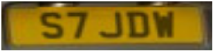

# Introduction

Welcome!

In this introductory workshop, you'll learn how to use **RHODS** to recognize licence plates in car pictures, and extract the number from this plate.

* We'll start from an image like this:

{:refdef: style="text-align: center;"}

{: refdef}

* Then we'll automatically recognize and extract this image:

{:refdef: style="text-align: center;"}

{: refdef}

* From which we will recognize the plate number, **S7JDW** !

And all of this without having to install anything on your own computer, thanks to **RHODS**!

## Starting the workshop

The workshop will be done into a RHODS environment. In the onboarding email you should have received, you will find:

* The URL to connect to your environment
* A set of credentials you will use to authenticate

If you have those, you're ready to start! Click on the provided link to access the environment, login using the credentials, and [click here to go to the next section](step1.html).

## Support and contact

In trouble? Get support by joininn this channel or write to ...