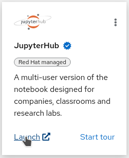

[Back to the introduction](index.html)

# Step 1: Starting a Jupyter environment

**RHODS** brings you on-demand Jupyter Notebooks environments. Don't worry if you've never used notebooks before, this workshop will start with a small tutorial on what they are and how to use them.

* Now that you are connected to the dashboard, click on the "Launch" link on the JupyterHub card:

{:refdef: style="text-align: center;"}

{: refdef}

If it's the first time you're launching Jupyter, you may be sent to a page that will ask for your authorization to use your user account to authenticate to Jupyter. You should of course allow this if you want to do the workshop...

* From the "Spawner Options" page, there are multiple options you choose from to launch your environment.
  * From the `JupyterHub Notebook Image` dropdown, select `s2i-tensorflow-notebook:v0.0.2`, as this is the flavor of notebook we want to use. It includes the Tensorflow library, which is used to do image recognition.
  * From the `Container size` dropdown, select `Default`.
  * The other parameters are not useful for this workshop, but you can see that there are other things we can do from the Spawner, like selecting GPUs if we want them in our environment, or inject some Environment variables into our environment.

* At the bottom of the page you can now click on the Start button:

{:refdef: style="text-align: center;"}

{: refdef}

While your environment is starting, [let's go to the next section](step2.html)
