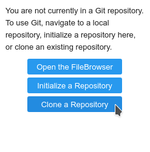
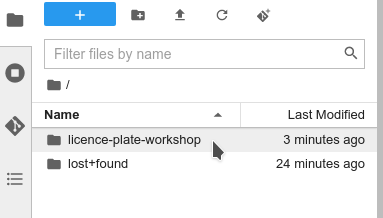
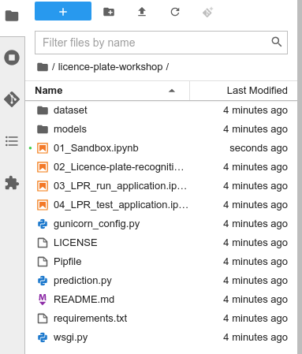

[Back to the previous section](step1.md)

# Step 2: The Jupyter environment

You are now inside your Jupyter environment. As you can see, it's a web-based environment, but everything you'll do here is in fact happening on the **Red Hat OpenShift Data Science** cluster. This means that without having to install and maintain anything on your own computer, and without disposing of lots of local resources like CPU and RAM, you can still conduct your Data Science work in this powerful and stable managed environment.

In the "file-browser" like window you're in right now, you'll find the files and folders that are saved inside your own personal space inside **Red Hat OpenShift Data Science**. It's pretty empty right now though... So the first thing we will do is to bring the content of the workshop inside this environment.

* On the left toolbar, click on the Git icon:

{:refdef: style="text-align: center;"}

{: refdef}

* Then click on "Clone a Repository":

{:refdef: style="text-align: center;"}

{: refdef}

* Enter this URL, `https://github.com/rh-aiservices-bu/licence-plate-workshop.git`, then click on "CLONE":

{:refdef: style="text-align: center;"}

{: refdef}

* It takes a few seconds, after which you can double-click and navigate to the newly-created folder, `licence-plate-workshop`:

{:refdef: style="text-align: center;"}

{: refdef}
---
{:refdef: style="text-align: center;"}

{: refdef}

[Ready? Let's go to the next section.](step3.md)

## Navigation

<!-- startnav -->
* [Red Hat OpenShift Data Science Workshop - Licence plate recognition](index.md)
* [Step 1: Starting a Jupyter environment](step1.md)
* [Step 2: The Jupyter environment](step2.md)**<-- you are here**
* [Step 3: Notebooks](step3.md)
* [Step 4: Licence plate recognition](step4.md)
* [Step 5: Packaging the model as an API](step5.md)
* [Step 6: Packaging our application](step6.md)
* [Step 7: Testing the application](step7.md)
* [Conclusion](step8.md)
<!-- endnav -->
