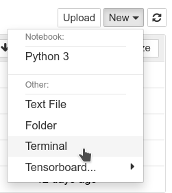

[Back to the previous section](step2.html)

# Step 3: Notebooks

This section is a small introduction on how to use Jupyter Notebooks if you've never done this before or need a quick refresh. If you're already at ease with this, you can [directly head to the next section](step4.html).


* On the upper right side click on `New`, then select `Terminal`:

{:refdef: style="text-align: center;"}

{: refdef}

This will open a new Tab on your browser, with access to a prompt.

* From this promt, enter this command to copy the content of the workshop inside your environment:

```bash
git clone https://github.com/rh-aiservices-bu/licence-plate-workshop.git
```

The content is now copied, with something that should look like:

```bash
Cloning into 'licence-plate-workshop'...
remote: Enumerating objects: 92, done.
remote: Counting objects: 100% (92/92), done.
remote: Compressing objects: 100% (71/71), done.
remote: Total 92 (delta 18), reused 78 (delta 11), pack-reused 0
Unpacking objects: 100% (92/92), 20.00 MiB | 542.00 KiB/s, done.
```

* You can now just close this Terminal tab and get back to Jupyter.

[Ready? Let's go to the next section](step4.html)
