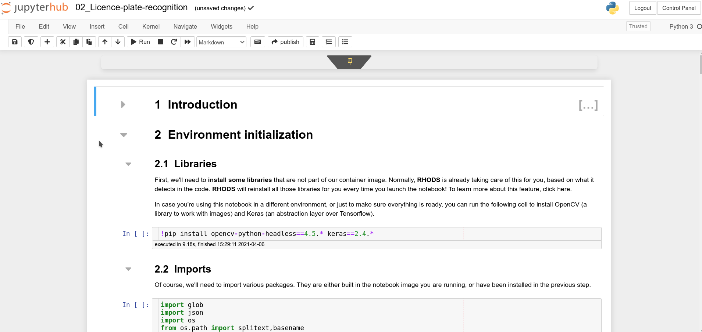
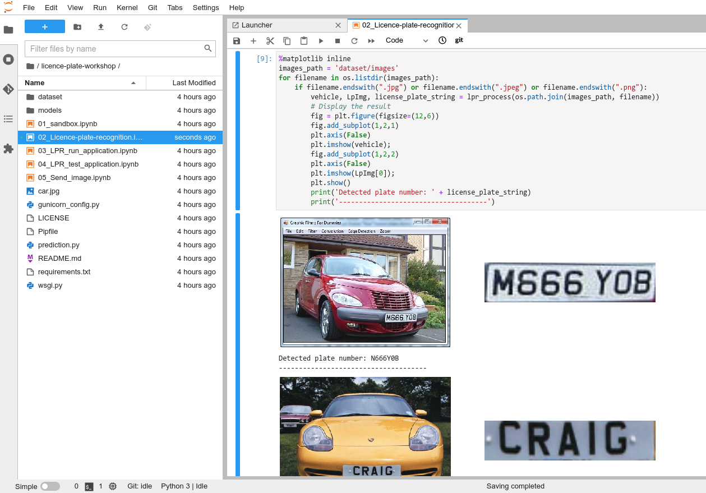

[Back to the previous section](step3.md)

# Step 4: Licence plate recognition

Now that you know how the environment works, the real work can begin!

Still in you environment, just open the file `02_Licence-plate-recognition.ipynb`, and follow the instructions directly in the notebook!

{:refdef: style="text-align: center;"}

{: refdef}

At the end of the notebook, it will look like this:

{:refdef: style="text-align: center;"}

{: refdef}

Once you're finished, you can come back here and [head to the next section.](step5.md)

## Navigation

<!-- startnav -->
* [Red Hat OpenShift Data Science Workshop - Licence plate recognition](index.md)
* [Step 1: Starting a Jupyter environment](step1.md)
* [Step 2: The Jupyter environment](step2.md)
* [Step 3: Notebooks](step3.md)
* [Step 4: Licence plate recognition](step4.md)**<-- you are here**
* [Step 5: Packaging the model as an API](step5.md)
* [Step 6: Packaging our application](step6.md)
* [Step 7: Testing the application](step7.md)
* [Conclusion](step8.md)
<!-- endnav -->
