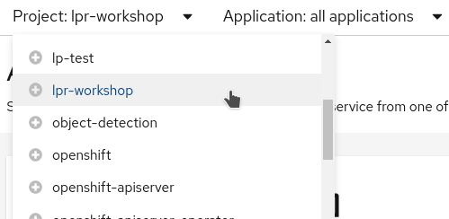
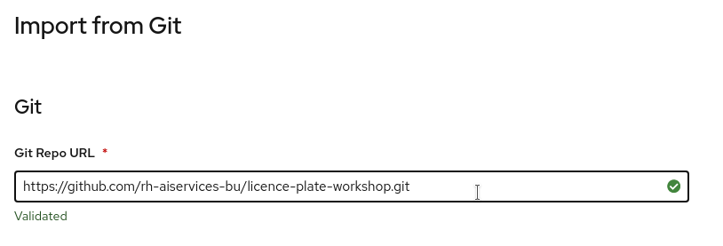
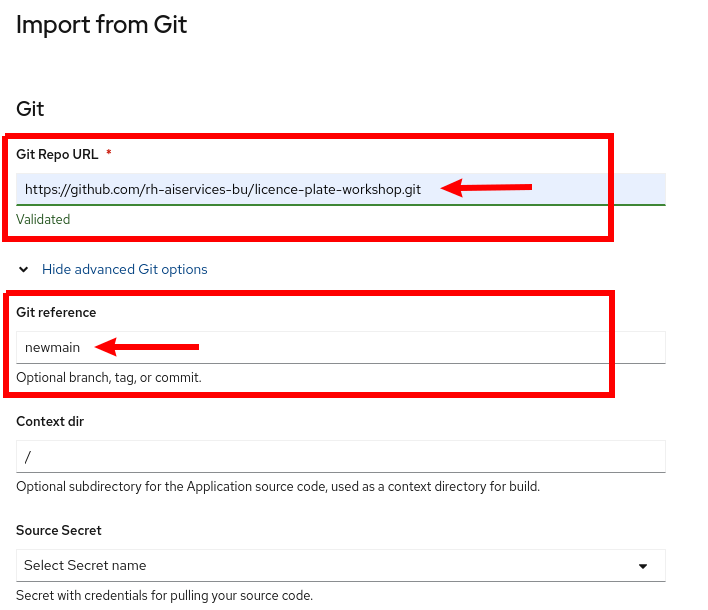
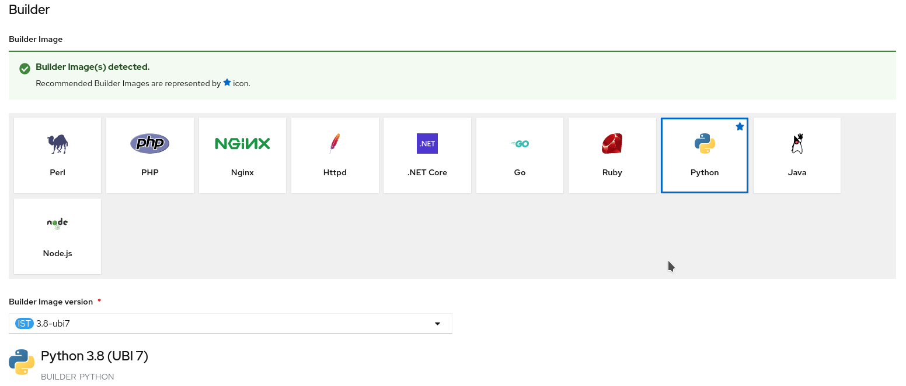
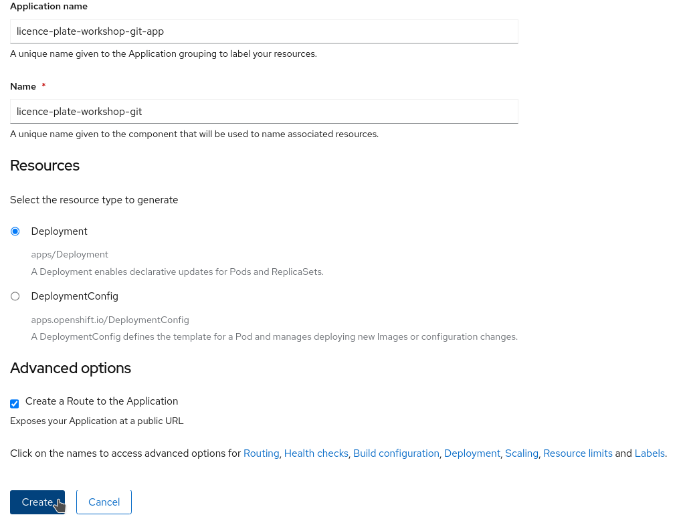
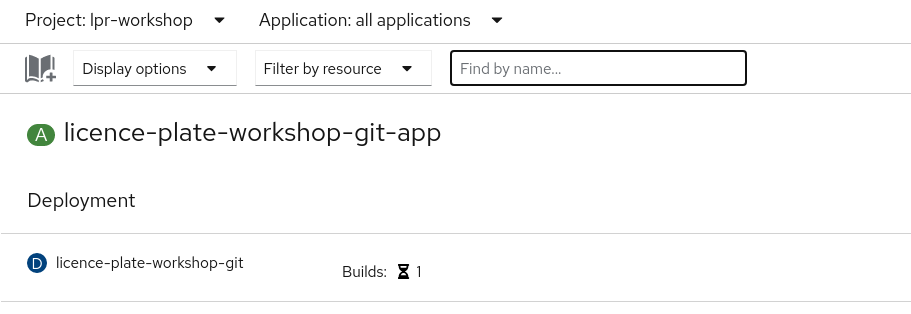
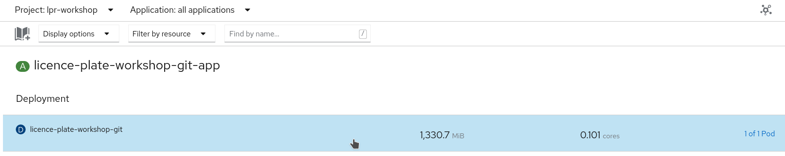
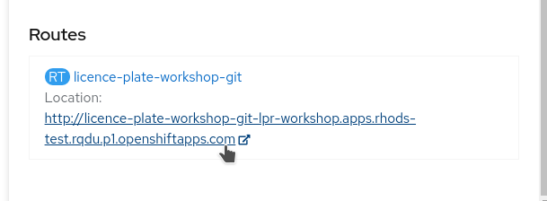

[Back to the previous section](step5.md)

# Step 6: Packaging our application

Now that the application code is working, we're ready to package it as a container image, and have it running directly into OpenShift as a service you will be able to call from any other application.

**Note**: the application code is available in the same repo we've been using before, but in the `app` branch. It is the same content as we had in our notebooks, except that instead of passing an image name to the prediction function, we will be able to directly upload any image!

## Building the application inside OpenShift

* Open your OpenShift UI and switch to the developer view from the menu on the top left:

{:refdef: style="text-align: center;"}

{: refdef}

* Make sure you are in the right project that was assigned to you:

{:refdef: style="text-align: center;"}

{: refdef}

* From the `+Add` menu, click on the `From Git` tile:

{:refdef: style="text-align: center;"}

{: refdef}

* In the `Git Repo URL`field, enter: `https://github.com/rh-aiservices-bu/licence-plate-workshop.git`

{:refdef: style="text-align: center;"}

{: refdef}

* **Don't miss this step!** Click on `Show advanced Git options`, and in the `Git reference` field, enter `main` (this is the branch to use in our github project):

{:refdef: style="text-align: center;"}

{: refdef}

* Leave the other fields as default and scroll down. You will see that OpenShift automatically recognized that our repo contains Python code, and that the right base image has been selected. Pretty neat, eh?!

{:refdef: style="text-align: center;"}

{: refdef}

* If you continue to scroll down, you will see that everything is automatically selected to create a deployment of your application, and to create a Route through which you will be able to access it. Everything is ready, so you can click on `Create`:

{:refdef: style="text-align: center;"}

{: refdef}

* You will see that a build is going on:

{:refdef: style="text-align: center;"}

{: refdef}

* The automated building process will take a few minutes. Some Alerts may appear if OpenShift tries to deploy while the build is still running, but that's OK. Then OpenShift will deploy the application (rollout), and in the topolody view you should obtain something like this:

{:refdef: style="text-align: center;"}

{: refdef}

* Just click on the application line to open a detail panel on the right:

{:refdef: style="text-align: center;"}

{: refdef}

* If you scroll down on the detail panel, you will see the route that was created for your application. This is the URL you will use to send images:

{:refdef: style="text-align: center;"}

{: refdef}

Once you're finished, you can come back here and [head to the next section.](step7.md)

## Navigation

<!-- startnav -->
* [Red Hat OpenShift Data Science Workshop - Licence plate recognition](index.md)
* [Step 1: Starting a Jupyter environment](step1.md)
* [Step 2: The Jupyter environment](step2.md)
* [Step 3: Notebooks](step3.md)
* [Step 4: Licence plate recognition](step4.md)
* [Step 5: Packaging the model as an API](step5.md)
* [Step 6: Packaging our application](step6.md)**<-- you are here**
* [Step 7: Testing the application](step7.md)
* [Conclusion](step8.md)
<!-- endnav -->
